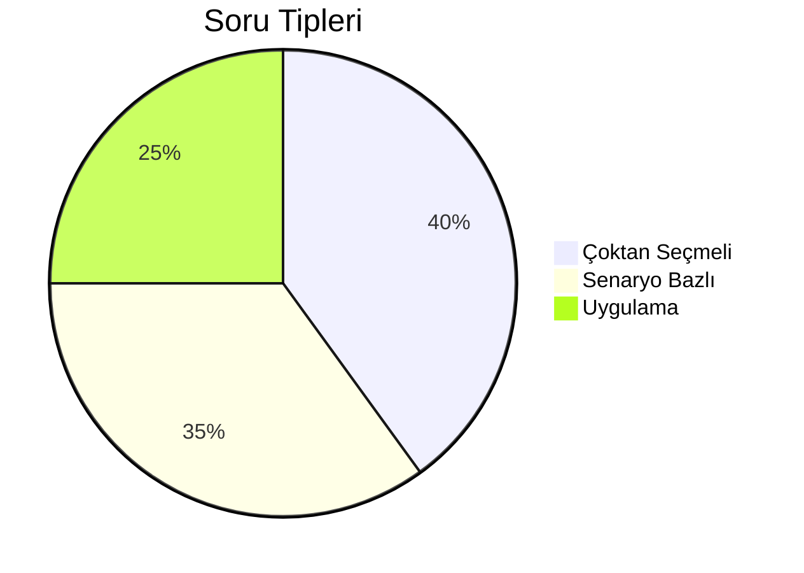
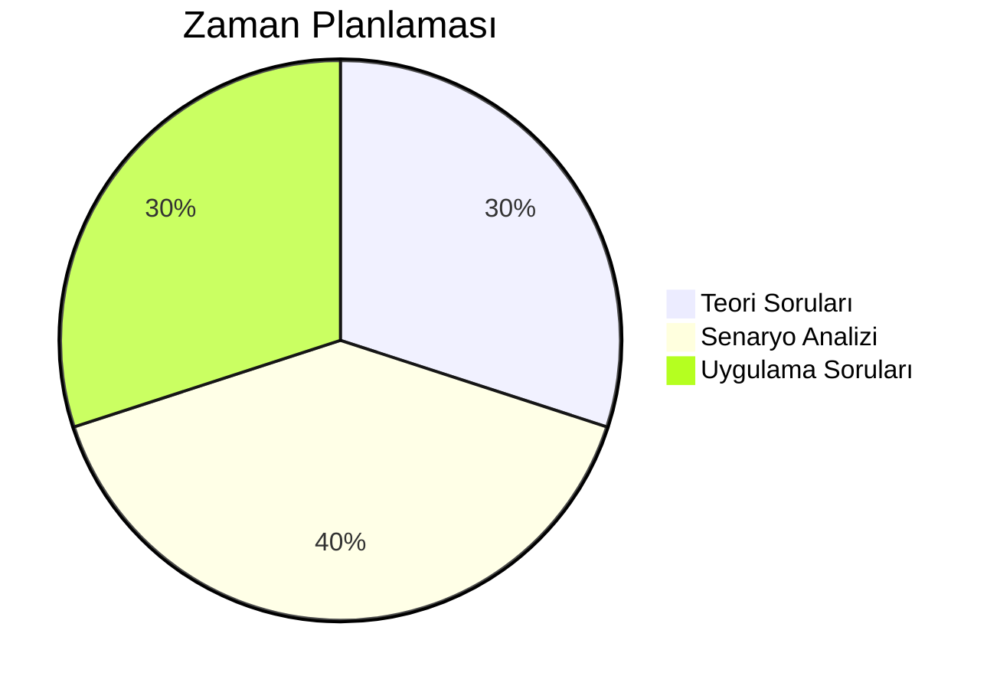

# Bölüm 1: Giriş

## ISAQB CPSA Sertifikası Hakkında

---
layout: two-cols
---

# Sertifika Değeri

## 🎯 Neden ISAQB?
- Uluslararası tanınırlık
- Profesyonel gelişim 
- Endüstri standardı

::right::

 

---
layout: center
---

# Sınav Yapısı

<h3>📝 Soru Dağılımı</h3>

<h3>⏱️ Süre Dağılımı</h3>

