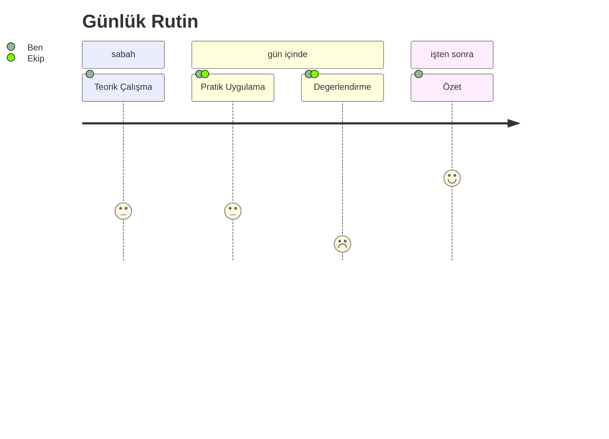

# Bölüm 2: Program Yapısı

## 2 Haftalık Yoğun Hazırlık

---
layout: two-cols
---

# Program Bileşenleri

## 📚 Kaynaklar
- Ana kaynak: Sınava hazırlık PDF kitabı(Mail ile iletildi)
- Eğitim slaytları
- Mock Exam

## ⚡ Çalışma Yöntemi
- Günlük hedefler ile Bireysel çalışma
- Zoom chat meeting
- Öz değerlendirme
- Bölüm sorularının çözülmesi
- Mock Exam sınavı

::right::

# Günlük Rutinler

 

