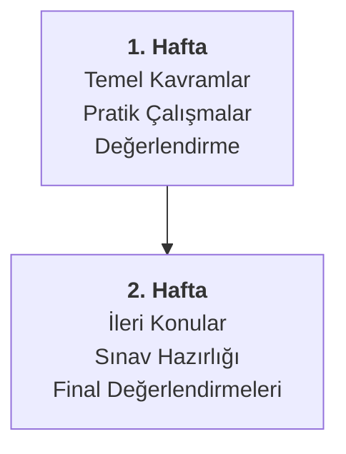
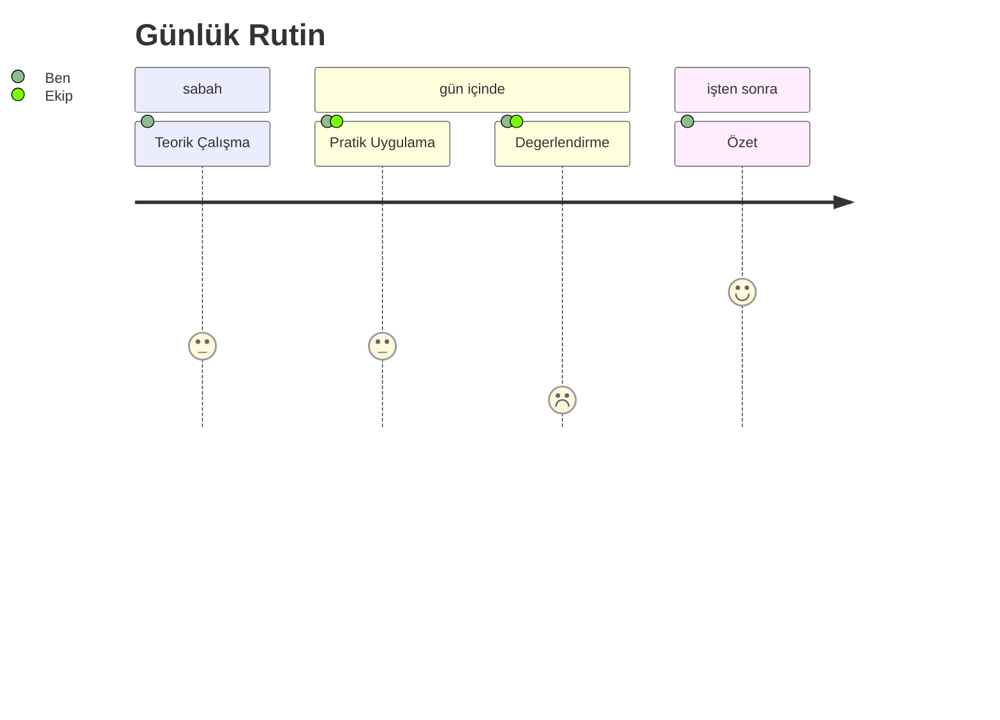

# Bölüm 2: Program Yapısı

## 2 Haftalık Yoğun Hazırlık

---
layout: two-cols
---

# Program Bileşenleri

## 📚 Ana Başlıklar
- Mimari Temeller
- Tasarım Desenleri
- Kalite Özellikleri
- Dokümantasyon
- Değerlendirme Yöntemleri

## ⚡ Çalışma Yöntemi
- Bireysel çalışma
- Zoom chat meeting
- Pratik uygulamalar
- Öz değerlendirme

::right::

# Program Akışı

---
layout: center
---

# Günlük Rutinler

