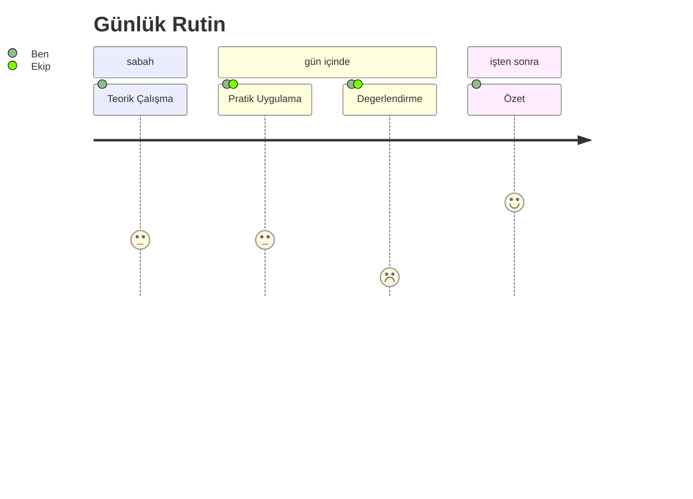
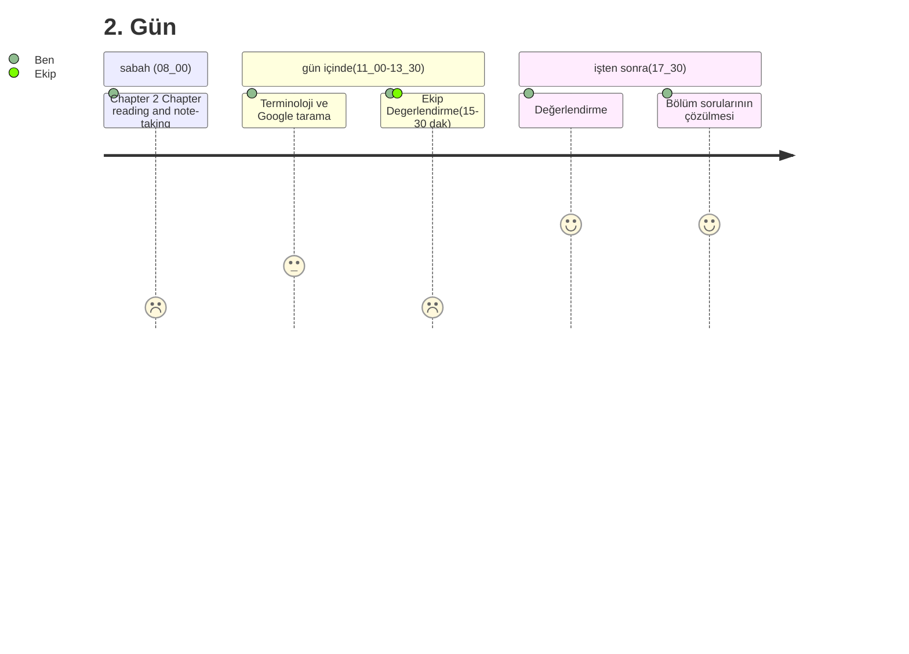
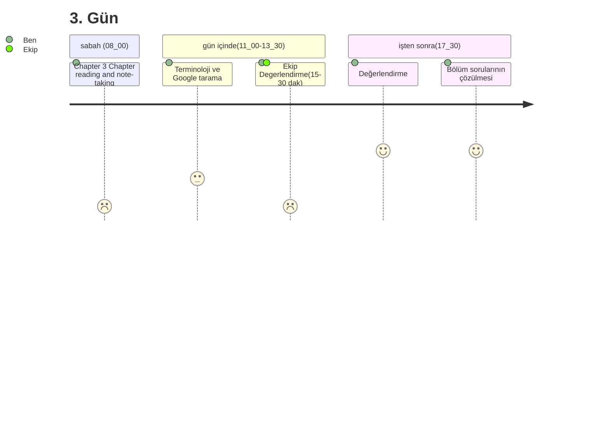

# Günlük Program
13-21 Kasım/November 2024

---

# Program Yapısı / Program Structure

- **1. Gün (13 Kasım)**: Basic Concepts of Software Architecture / Yazılım Mimarisinin Temel Kavramları
- **2. Gün (14 Kasım)**: Design and Development of Software Architectures / Yazılım Mimarilerinin Tasarımı ve Geliştirilmesi
- **3. Gün (15 Kasım)**: Specification and Communication of Software Architectures / Yazılım Mimarilerinin Tanımlanması ve İletişimi
- **4. Gün (18 Kasım)**: Software Architecture and Quality / Yazılım Mimarisi ve Kalite
- **5. Gün (19 Kasım)**: Examples of Software Architecture & Additional Materials / Yazılım Mimarisi Örnekleri ve Ek Materyaller



---

# Günlük Çalışma Planı / Daily Study Plan

- 📚 Sabah / Morning: Chapter reading and note-taking
- 🔍 Öğlen / Noon (11:00-13:30): Term research
- 👥 Ekip tartışması / Team discussion (15-30 min)
- ✍️ Akşam / Evening (17:30-18:00): Self-assessment and sample questions

---

# 1. Gün / Day:
Basic Concepts of Software Architecture

13 Kasım/November 2024

#### _Sabah Hedefi:_
### __Chapter 1__
```
    - LG 1-1: Definitions of software architecture
    - LG 1-2: Goals and benefits of software architecture
    - LG 1-3: Software architecture in the software lifecycle
    - LG 1-4: Software architects' tasks and responsibilities
    - LG 1-5 to 1-11: Additional fundamental concepts
```


---

# 2. Gün / Day:
Design and Development of Software Architectures

14 Kasım/November 2024

#### _Sabah Hedefi:_
### __Chapter 2__
```
    - LG 2-1: Approaches and heuristics
    - LG 2-2: Design software architectures
    - LG 2-3: Influencing factors
    - LG 2-4: Cross-cutting concepts
    - LG 2-5 to 2-9: Patterns and principles
```



---

# 3. Gün / Day: Specification and Communication of Software Architectures
15 Kasım/November 2024

#### Sabah Hedefi:
### __Chapter 3__
```
    - LG 3-1: Quality requirements for documentation
    - LG 3-2: Describe and communicate architectures
    - LG 3-3: Models and notations
    - LG 3-4: Architectural views
    - LG 3-5 to 3-10: Documentation aspects
```


