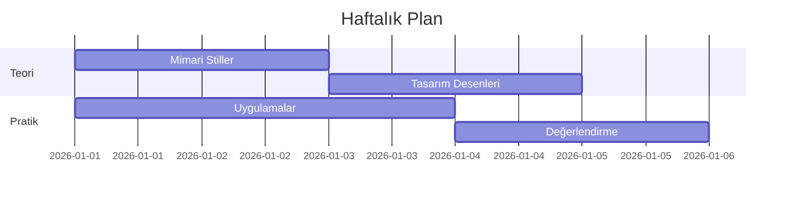
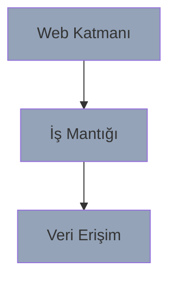

# Bölüm 3: 1. Hafta

## Temel Kavramlar ve Uygulamalar

---
layout: two-cols
---

# 1. Hafta Plan

## 📅 Pazartesi-Çarşamba
- Mimari stiller
- Tasarım desenleri
- SOLID prensipler
- Modülerlik

## 📅 Perşembe-Cuma
- Dokümantasyon
- Kalite özellikleri
- İlk değerlendirme
- Geri bildirim

::right::

---
layout: default
---

# Pratik Uygulamalar

<h3>🏗️ Mimari Tasarım</h3>

<h3>📝 Dokümantasyon</h3>

- arc42 şablonu
- Görünümler
- Kararlar
- Senaryolar

