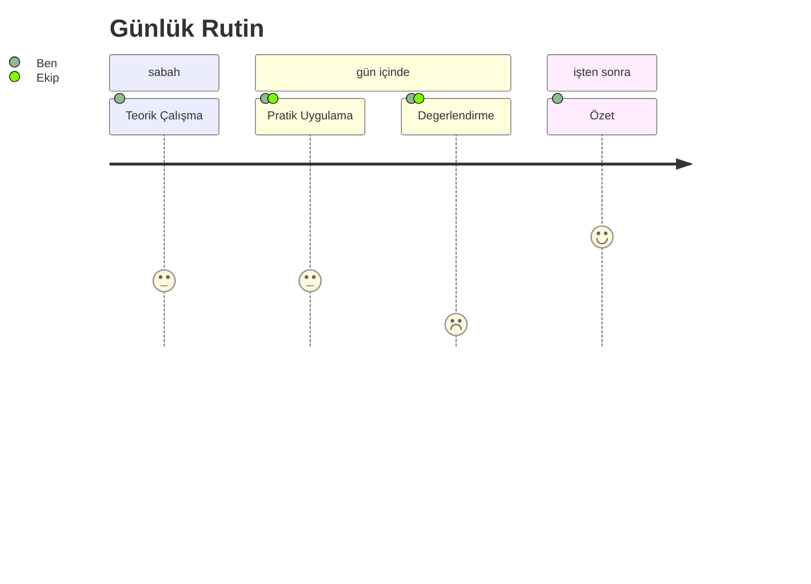
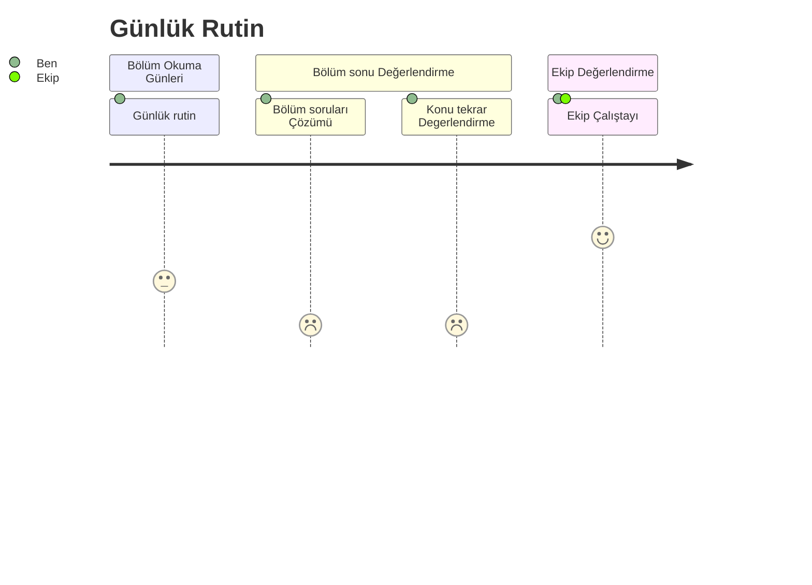

# Günlük Program
13-21 Kasım/November 2024


# Program Yapısı / Program Structure

- **1-3. Günler (13-15 Kasım)**: Basic Concepts of Software Architecture / Yazılım Mimarisinin Temel Kavramları
- **4-8. Gün (18-21 Kasım)**: Design and Development of Software Architectures / Yazılım Mimarilerinin Tasarımı ve Geliştirilmesi
- **9-14. Gün (22-27 Kasım)**: Specification and Communication of Software Architectures / Yazılım Mimarilerinin Tanımlanması ve İletişimi
- **15-16. Gün (28-29 Kasım)**: Software Architecture and Quality / Yazılım Mimarisi ve Kalite
- **17-18. Gün (1-2 Aralık)**: Examples of Software Architecture & Additional Materials / Yazılım Mimarisi Örnekleri ve Ek Materyaller
- **19-20. Gün (3-4 Aralık)**: Mock Exam - Final Preparation / Mock exam - son hazırlık ve ekip toplantısı
- **21. Gün (5-6-7 Aralık)**: The Exam 


---

# Günlük Çalışma Planı / Daily Study Plan

- 📚 Sabah / Morning: Chapter reading and note-taking
- 🔍 Öğlen / Noon (11:00-13:30): Term research
- 👥 Ekip tartışması / Team discussion (15-30 min)
- ✍️ Akşam / Evening (17:30-18:00): Self-assessment and sample questions



---

# Bölüm Çalışma Rutini / Chapter Rutine

- 📚 Bölüm Okuma / Günlük rutin : Chapter reading and note-taking
- 🔍 Bölüm Sonu Değerlendirme / Chapter Assessment : Chapter Questions
- 👥 Bölüm Ekip tartışması / Chapter Team discussion (15-30 min)




---

# 1. Bölüm
Basic Concepts of Software Architecture

1-3. Günler (13-15 Kasım)

#### _Bölüm Okuma Hedefi:_
### __Chapter 1__
```
    - LG 1-1: Definitions of software architecture
    - LG 1-2: Goals and benefits of software architecture
    - LG 1-3: Software architecture in the software lifecycle
    - LG 1-4: Software architects' tasks and responsibilities
    - LG 1-5 to 1-11: Additional fundamental concepts
```


---

# 2. Bölüm: 
Design and Development of Software Architectures

4-8. Gün (18-21 Kasım)

#### _Bölüm Okuma Hedefi:_
### __Chapter 2__
```
    - LG 2-1: Approaches and heuristics
    - LG 2-2: Design software architectures
    - LG 2-3: Influencing factors
    - LG 2-4: Cross-cutting concepts
    - LG 2-5 to 2-9: Patterns and principles
```

---

# 3. Bölüm: Specification and Communication of Software Architectures

9-14. Gün (22-27 Kasım)

#### _Bölüm Okuma Hedefi:_
### __Chapter 3__
```
    - LG 3-1: Quality requirements for documentation
    - LG 3-2: Describe and communicate architectures
    - LG 3-3: Models and notations
    - LG 3-4: Architectural views
    - LG 3-5 to 3-10: Documentation aspects
```


---

# 4. Bölüm : Software Architecture and Quality

15-16. Gün (28-29 Kasım)

#### _Bölüm Okuma Hedefi:_
### __Chapter 4__
```
- LG 4-1: Quality models and characteristics
- LG 4-2: Clarify quality requirements
- LG 4-3: Qualitative analysis
- LG 4-4: Quantitative evaluation
```

 
---


# 5. Bölüm: Examples & Additional Materials

17-18. Gün (1-2 Aralık)

#### _Bölüm Okuma Hedefi:_
### __Chapter 5 Part III: Background Part IV: Moving On Part V: Appendices :__
```
Chapter 5 
    - LG 5-1: From requirements to solution
    - LG 5-2: Rationale of technical implementation

Part III: Background
Part IV: Moving On
Part V: Appendices
    - Appendix A: About the Authors
    - Appendix B: Glossary of Terms
    - Appendix C: References and Further Reading
```

 
---

# 6. Bölüm : Mock Exam - Final Preparation / Mock exam - son hazırlık ve ekip toplantısı

19-20. Gün (3-4 Aralık)


### Assessment Days Schedule ()

## __Day 6 (20 November) - Mock Exam Day__
<br/>

### Morning:
    - Practice exam under test conditions
    - Time management practice
    - Question types familiarization

<br/>

### Afternoon:
    - Review of mock exam answers
    - Identifying knowledge gaps
    - Focus areas determination
    - Question strategy discussion

---

## __7. Bölüm / Day - Final Review & Assessment__
<br/>


## Morning:
    - Quick review of challenging topics
    - Q&A session
    - Study strategy for remaining days until exam
    - Final tips and techniques
<br/>

## Afternoon:
    - Final self-assessment
    - Exam preparation checklist review
    - Study plan for maintaining knowledge
    - Final queries and clarifications

---

# Sınav

21. Gün (5-6-7 Aralık)