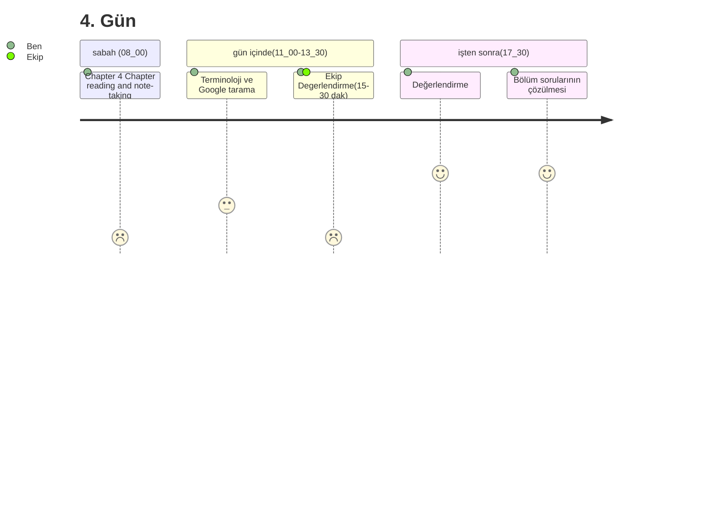
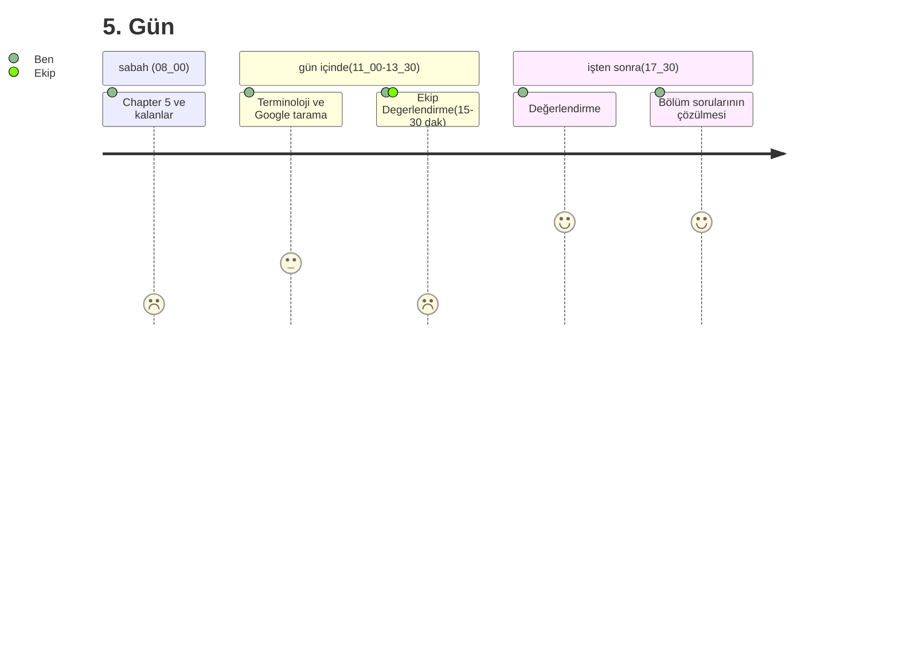

---

# 4. Gün / Day: Software Architecture and Quality
18 Kasım/November 2024
#### Sabah Hedefi:
### __Chapter 4__
```
- LG 4-1: Quality models and characteristics
- LG 4-2: Clarify quality requirements
- LG 4-3: Qualitative analysis
- LG 4-4: Quantitative evaluation
```


---

# 5. Gün / Day: Examples & Additional Materials
19 Kasım/November 2024

#### Sabah Hedefi:
### __Chapter 5 Part III: Background Part IV: Moving On Part V: Appendices :__
```
Chapter 5 
    - LG 5-1: From requirements to solution
    - LG 5-2: Rationale of technical implementation

Part III: Background
Part IV: Moving On
Part V: Appendices
    - Appendix A: About the Authors
    - Appendix B: Glossary of Terms
    - Appendix C: References and Further Reading
```


---

# 6. Gün / Day: Examples & Additional Materials
20 Kasım

 
### Assessment Days Schedule ()

## __Day 6 (20 November) - Mock Exam Day__
<br/>

### Morning:
    - Practice exam under test conditions
    - Time management practice
    - Question types familiarization

<br/>

### Afternoon:
    - Review of mock exam answers
    - Identifying knowledge gaps
    - Focus areas determination
    - Question strategy discussion

---

## __7. Gün / Day - Final Review & Assessment__
<br/>

## Morning:
    - Quick review of challenging topics
    - Q&A session
    - Study strategy for remaining days until exam
    - Final tips and techniques
<br/>

## Afternoon:
    - Final self-assessment
    - Exam preparation checklist review
    - Study plan for maintaining knowledge
    - Final queries and clarifications