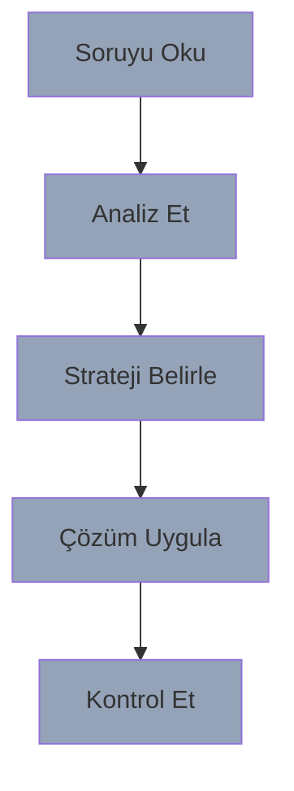

# Bölüm 5: Sınav Hazırlığı

## Başarı Stratejileri

---
layout: two-cols
---

# Sınav Taktikleri

## ⏱️ Zaman Yönetimi
- Soru okuma tekniği
- Önceliklendirme
- Hızlı eleme
- Kontrol zamanı

## 💡 Çözüm Stratejisi
- Anahtar kelimeler
- Sistematik yaklaşım
- Pattern eşleştirme
- Dokümantasyon düzeni

::right::

